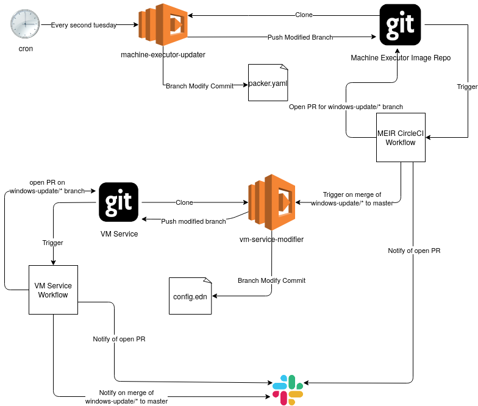

# Hephaestus

A project to automate the windows image build

## Design Things



A collection of python scripts to use on a scheduled AWS lambda to:

* Clone, branch, update, and push an updated packer file from the [machine-executor-images](https://github.com/circleci/machine-executor-images) repo 
* lambda will open a PR for `windows-update/*` branch
* when `windows-update/*` pr is opened workflow will notify #execution-teams about the PR being ready for merge
* when `windows-update/*` pr is merged to master workflow will trigger vm-service update lambda with image version names
* vm-service update lambda will clone, branch, and update the `config.edn` file with the new values
* vm-service update lambda will open PR for vm-service `windows-update/*` branch
* when `windows-update/*` pr is opened workflow will notify #execution-teams of PR being ready for merge
* when `windows-update/*` pr is merged to master, workflow will push a notification to #custeng-support #investigation and #execution-teams slack notifying of update

### Workflow changes

* windows update specific steps will trigger on `windows-update/*` titled branches 
* workflow behaviour will depend on if it is a `widnows-update/*` push or merge to master

### Undecided Stuff / Stuff to Investigate

* where to gen github tokens from, shouldn't be linked to a single engineers creds, do we have CCI github bot creds?


### Lambda Structure
Each lambda will use the whole hephaestus package, and an entry point module will determine the behaviour depending on how the lambda calls

### Configuration

All configuration data will be passed as environment variables:

* USERNAME : The git username to use for the git ops
* PASSWORD : The git password to use for the git ops

#### VM-Service Updater
Calling requires a map of the images to their URL formatted as 

```python
  {"windows-server-2019-base" : "base",
   "windows-server-2019-nvidia-small" : "nvidia-small",
   "windows-server-2019-nvidia-medium" : "nvidia-medium",
   "windows-server-2019-nvidia-large" : "nvidia-large"}
```

## Development
Developed in a `python3:buster` where the project is attached as a bind, and the `requirements.txt` is loaded manually. Once CI is implemented the CI can take care of building a dev conatiner with the latest requirements and stick its somewhere

### Image Diagram modification

use [draw.io](https://draw.io) to modify the image with the `docs/windows-machine-updater.drawio` file

## TODO

* Finish writing machine-image updater script and tests
* Merge requirements.txt to one top level package
* Start on vm-service tests
* set up lambdas
  * possibly via terraform in execution-infrastructure, probs doesn't belong in our main terraform
* design lambda CLI implementation
* setup CCI workflows
